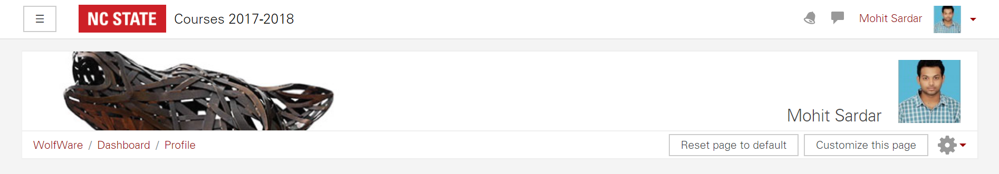
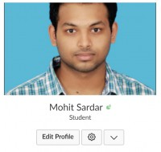

## CSC 519 - DevOps
# HW0

### Basic Course Setup
#### Moodle
The following is a screenshot of my Moodle profile that shows my name and uploaded image:

#### Slack
The following is a screenshot of my Slack profile that shows my name and uploaded image:

### Computing Environment
All the relevant files for this are in the folder `ComputingEnvironment/`. 
`ComputingEnvironment/trusty/` has all the vagrant files and folders for the virtual machine image. 
The `ComputingEnvironment/projects/` folder is the synced folder that contains the `express` project.

1. A virtual machine image was initialized
2. Vagrant file was edited to allow private network, synced folder "projects", and fix DNS issue
3. Inside VM, NodeJS was installed we ran the web server from the `express` project
4. `index.js` was edited, a `stop` command was added to `package.json` file.

The link to the screencast of the demo of this is at https://www.youtube.com/watch?v=Wb95g0MD4h0 .

### Pipeline

1. Clone App repo
2. Create deploy, production folders
3. Initalize a bare git repo inside `production.git`
4. Create post-receive hook
5. Create remote and push
6. Run App

The link to the screencast of the demo of this is at https://www.youtube.com/watch?v=67S1otfXmmI .

